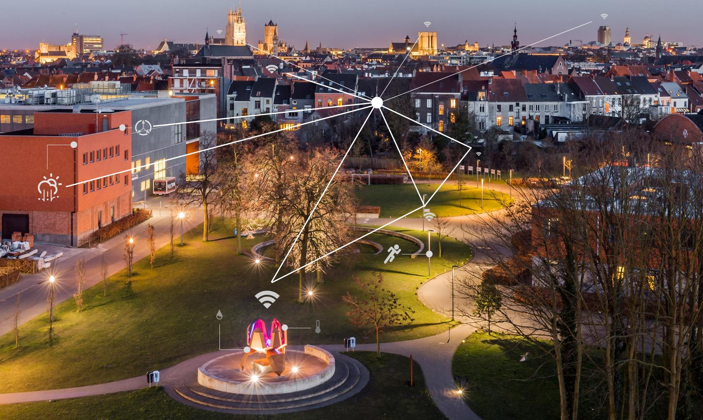

# Low power wireless communication technologies for connecting embedded sensors in the IoT
## A journey from fundaments to hands-on.

## Abstract
In this hands-on session the attendees will experience the development of a wireless sensor node. More specifically, how low-power operation can be achieved by clever utilization of the available resources. Such design choices include: selecting the right wireless technology, duty-cycled operation, hardware acceleration, etc.

The participants will experiment with a custom LoRa-based sensor, built with a [Semtec SX1272](http://www.semtech.com/wireless-rf/rf-transceivers/sx1272/) Radio chip and an [EFM32 Cortex M0](https://www.silabs.com/products/mcu/32-bit/efm32-happy-gecko) processor. The way operations are being performed on the node can be customized in the [Silabs Simplicity Studio IDE](https://www.silabs.com/products/development-tools/software/simplicity-studio). The effect of these changes on the energy consumption can be observed through the IDE’s built-in energy profiler.

In the end, the lecturers will have shown that the design of true low-power wireless sensors requires a thoughtful design. Both software and hardware need to work seamlessly together within the boundaries of a specific application.

## Team

##### Liesbet Van Der Perre
Liesbet Van der Perre received the M.Sc. and PhD degree in Electrical Engineering from the KU Leuven, Belgium, in 1992 and 1997 respectively. Dr. Van der Perre joined imec’s wireless group in 1997 in the wireless group.

##### Gilles Callebaut
Gilles graduated in 2016 and received the M.Sc. degree in engineering technology at KU Leuven, Belgium. He is currently a member of Dramco, a research group which is focused on wireless and mobile communication systems. 

##### Geoffrey Ottoy
Lorem ipsum dolor sit amet, consectetur adipiscing elit. Quisque mi lectus, mattis sed lacus sed, posuere euismod lectus. Pellentesque cursus dui tortor, nec malesuada libero aliquet vel. 

##### Bart Thoen
Mauris sed volutpat nunc. Praesent ipsum leo, facilisis in risus in, sollicitudin elementum ex. In quis est purus. Morbi neque elit, scelerisque eget hendrerit non, maximus vitae leo. Interdum et malesuad. 

##### Guus Leenders
Sed euismod venenatis nibh vulputate scelerisque. Donec tempus venenatis ultrices. Suspendisse imperdiet dignissim arcu, sed iaculis elit fringilla id. Ut lacinia mi sit amet nulla consequat porttitor.  