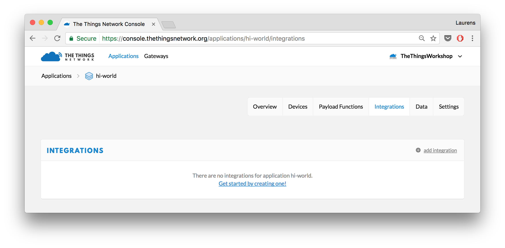
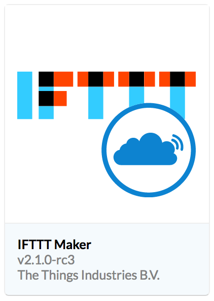

# Registering to the TTN
The Things Network is a global, open and crowd-sourced Internet of things data network. Wireless communication is provided by the LoRaWAN technology. In this tutorial we will use the existing network provided by TTN users.


https://account.thethingsnetwork.org/register

After registering, you can begin creating your own application.

# Making an Application
Navigate to your applications tab (https://console.thethingsnetwork.org/applications) and add a new application. Every application on the network needs an unique identifier. For this tutorial you can opt to choose the following format for your application ID: `low-power-sensor-tutorial-firstname-lastname`. Now, add your application. Through the application you van connect to The Things Network. One way is to use the low-level APIs via MQTT or HTTP. Another is possibility is to use 'Integrations'. They provide an abstraction from the code. An example of integration is to forward messages to some webhook, i.e. HTTP Integration.  

## Storing your Sensor Data
In this tutorial, we will make use of the database integration. To add an integration, navigate to the Integrations page in your application page. Now, you can add the Data Storage integration. That's it! You have created a database where all your device data is stored.

## Adding Devices to your Application
Before we can store sensor data we need to add devices to our application.
Again, a unique id is required to uniquely identify your node in your application. So choose a device ID. Therafter, the EUI of the device needs to be filled in. Make your life easier and just let the TTN worry about generating that field by clicking on the *'shuffle'* icon on the left. The same applies for the app key. The device EUI allows you devices to be uniquely addressable in the network. The `AppKey` will be used to encrypt the communication between your device and your application.

After adding your device you will see an overview of your device. One of the parameters is the activation method. This method describes how your device will connect to the network. In Over-the-Air Activation (OTAA) mode, devices first perform a join-procedure with the network, during which a dynamic `DevAddr` is assigned and security keys --an application session key `AppSKey` and a network session key `NwSKey`-- are negotiated with the device. With Activation by Personalization (ABP) the `DevAddr` and security keys are hardcoded in the device.

### More Information on Security Keys
These two session keys (`NwkSKey` and `AppSKey`) are unique per device, per session. If you dynamically activate your device (`OTAA`), these keys are re-generated on every activation. If you statically activate your device (ABP), these keys stay the same until you change them.


The network session key (`NwkSKey`) is used for interaction between the Node and the Network. This key is used to check the validity of messages (MIC check).

The application session key (`AppSKey`) is used for encryption and decryption of the payload. The payload is fully encrypted between the Node and the Handler component of The Things Network (which you will be able to run on your own server). This means that nobody except you is able to read the contents of messages you send or receive.


## Edit Payload Format
Instead of transmitting our sensor values every measurement, we cumulate the data and transmit it when our buffer is full. In this way, we will optimise the power consumption of our IoT node.

We need to distinguish between different sensor measurements. This can be done through the application port. This field in the LoRaWAN packet is used by the MAC layer to _XXXXXXXXXXXXXXXXXXXX_. The values 0 to 255 can be freely used. Hence, we will make use of the app port to determine which type of data the packet carries.

In our application the following structure is used:

| App Port | Sensor Type | Payload Type | Bytes per Measurement (`numBytes`) |
|:--------:|:-----------:|:------------:|:----------------------------------:|
|     1    | temperature | Array        | 2                   			     |
|     2    |  humidity   | Array        | 2                   			     |
|     3    |  Text       | Array        | N.A.                			     |
|     4    |  mixed\*    | Array        | N.A.                			     |

\* When the server receives a _mixed_ package, the payload will consist out of different sensors typed values.
To determine the meaning of the bytes in the payload we need to decode it apprioraty. We payload is structured as follows:
- `Pnum`: 1 byte - number of values
- `Pvalues`: `Pnum` number of sensor data for that specific sensor type

Example:
[2 255 255 0]
First 2 means that there are 2 bytes for the first sensor type (i.e. temp).
The last 0 means that there is no data for the second sensor type (i.e. humidity).


Thus, the payload first needs to be decoded before it can be stored in our database. This can be done by using the build-in `Payload Formats` function in your application. We will decode our own `custom` payload format.

The following code will act as the decoder:
```javascript
function Decoder(bytes, port) {
  var decoded = {};
  decoded.temperature = [];
  decoded.humidity = [];
  
  switch(port){
    case 1 : 
      // temp data
      decoded.temperature = bytesToArray(bytes);
      break;
    case 2:
      // humidity data
      decoded.humidity = bytesToArray(bytes);
      break;
      case 3:
        decoded.text= bin2string(bytes);
        break;
    case 4:
      // mixed data
      // first byte == number of temp values
      var startTemp = 0;
      var numTempValues = parseInt(bytes[startTemp]);
      if(numTempValues!==0){
        var tempBytes = bytes.slice(startTemp+1,startTemp+1+numTempValues);
      decoded.temperature = bytesToArray(tempBytes);
      }
      
      // same for humidity
      var startHumidity = 1+numTempValues;
      var numHumidityValues = parseInt(bytes[startHumidity]);
      if(numHumidityValues!==0){
        var humidityBytes = bytes.slice(1+startHumidity,startHumidity+1+numHumidityValues);
      decoded.humidity = bytesToArray(humidityBytes);
      }
      
      break;
  }

  return decoded;
}

function bytesToArray(bytes){
  var data_size = 2;
  var num_byte_el = bytes.length;
  var num_readings = parseInt(num_byte_el/data_size);
  var readings = [];
  var offset = 0;
  
  for(var reading_id = 0; reading_id<num_readings; reading_id++){
    var value = ( ( (bytes[reading_id+offset] << 8) | bytes[reading_id+offset+1]) << 16) >> 16;
    // ensure values are unsigned
    if(value < 0) value = value + 65536;
    // values (doubles) are sent as floats: 24.6C -> 24600
    readings.push(parseFloat(value)/1000.0);
    offset += data_size-1;
  }
  
  console.log(readings);
  return readings;
  
}

function bin2string(array){
	var result = "";
	for(var i = 0; i < array.length; ++i){
		result+= (String.fromCharCode(array[i]));
	}
	return result;
}
```

So now we have ensured our data coming from our devices are stored in a database. We also made sure our device data was first decoded based on the payload format described above. We can finally begin with developing our IoT node!


# Low Power Tweet
A common use case is to invoke an HTTP request to an external web service. for this workshop we are going to process the sensor data and send it to [IFTTT](https://ifttt.com) (If This Then That) to trigger an event of your own choice. 

! IFTTT is a free web-based service that you can use to create simple conditional statements, called applets.
! An applet is triggered by changes that occur within other web services such as Gmail, Facebook, Instagram, or The Things Network.

## Create the IFTTT Applet
Let's start on IFTTT.

!! The IFTTT for this example is already made.
!! However, the instructions for creating and connecting the IFTTT is discussed below.

1.  Go to [IFTTT](https://ifttt.com) and create an account or login.
2.  Select [New Applet](https://ifttt.com/create) from your account menu.
3.  Click **This** to Choose Trigger Channel.

    1.  Search for `maker`.
    2.  Click the **Webhooks** channel.

    The first time you'll need to click **Connect**, then **Done** in the popup that opens and finally **Continue to the next step**.
    
4.  Click **Receive a web request**.

    *  Enter the **Event Name**:  `tutorial_button_pressed`.
    
5.  Click **That** to configure an action, i.e. post a tweet on Twitter.

    Use the field `Value1` as ingredient. For example, in our case a tweet could be:
    
    ```
    {{Value1}} #DRAMCO #LowPowerIoT
    ```

7.  Click **Create action**.
8.  Click **Finish**. 
    Good job! You created the Applet on IFTTT. The only thing you have to do now it connect The Things Network to your Applet and trigger the event with the sensor data.
    

## Connect The Things Network to IFTTT

1.  Go back to your application in the [Console](https://console.thethingsnetwork.org/applications) and click on **Integrations**.

    

2. Add as a new integration the **IFTTT Maker**.

    

3.  Think of a fancy Process ID, like `low-power-tweet` and fill in the **Event Name** (i.e. `tutorial_button_pressed`) you just created on IFTTT.
4.  To find your secret **Key**, go to [ifttt.com/maker and then **Settings**](https://ifttt.com/services/maker_webhooks/settings). Your key is the last part of the URL (after `/use/`). In our case, the **Key** is `cKUySRZC0RYDT350rpi3-m-CRwWJZ70so_k6DLoo_js`
5.  As **Value 1** write `text`
	*Make sure you don't accidentally add a space before or after `text`*
6.  Click on **Add Integration** to finalize the integration.

To summarise:
- Process ID: choose a 'random' ID
- Event Name: `tutorial_button_pressed`
- Key: `cKUySRZC0RYDT350rpi3-m-CRwWJZ70so_k6DLoo_js`
- Value 1: `text`